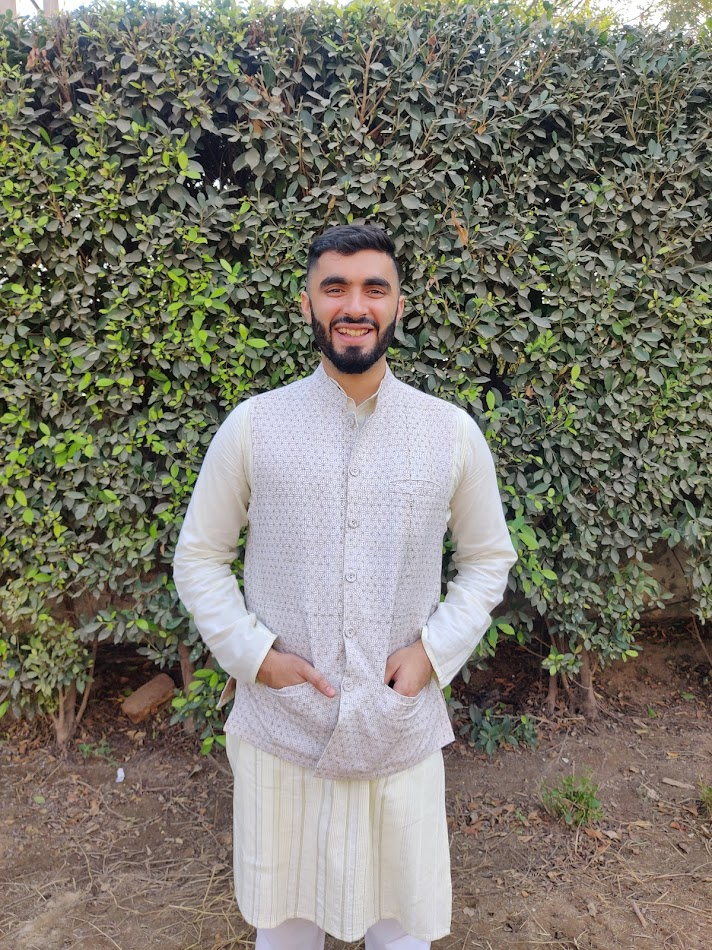

```{r setup, include=FALSE}
knitr::opts_chunk$set(echo = FALSE)
```

<br>

<div class="col2">   I am a Consultant at the world Bank working as a research assistant with Dr. Vijayendra Rao, Dr. Siddharth George and Dr. M. R. Sharan.

I previously worked as a research assistant with Dr. Farzana Afridi and Dr. Kanika Mahajan.

I have a Master's in Economics from Delhi School of Economics and a Bachelor's degree in Management Studies from Shaheed Sukhdev College of Business Studies, Delhi University. 

My research interests focus on Political Economy and Development Economics. 
 </div>

<div class="col2">

 </div>

